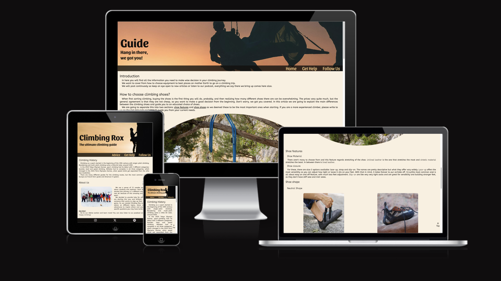
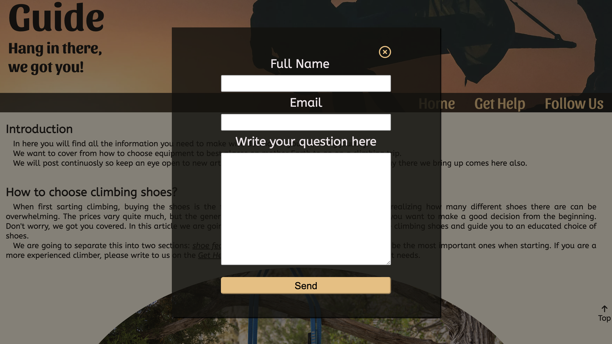
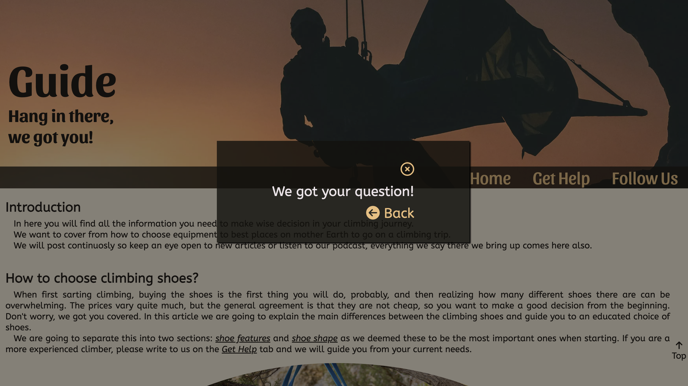
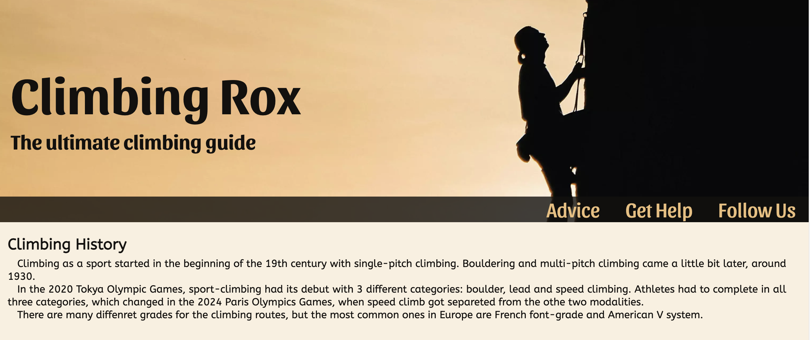
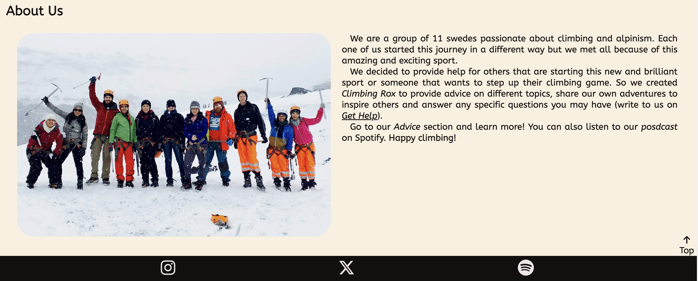
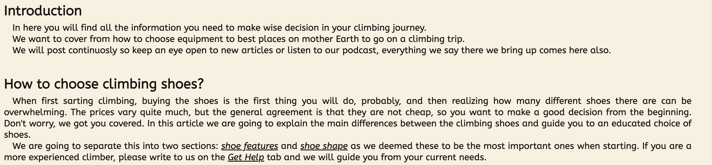
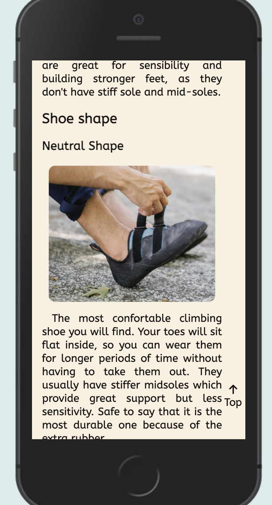
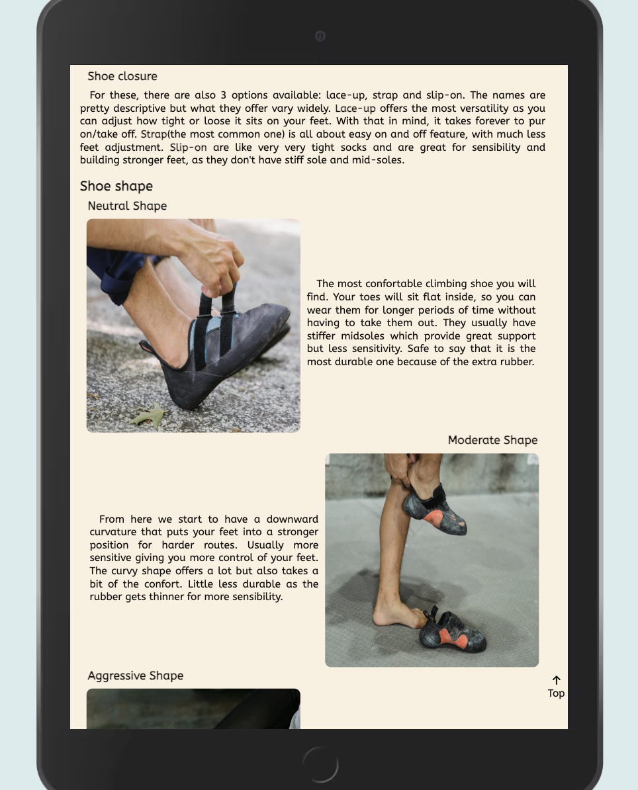
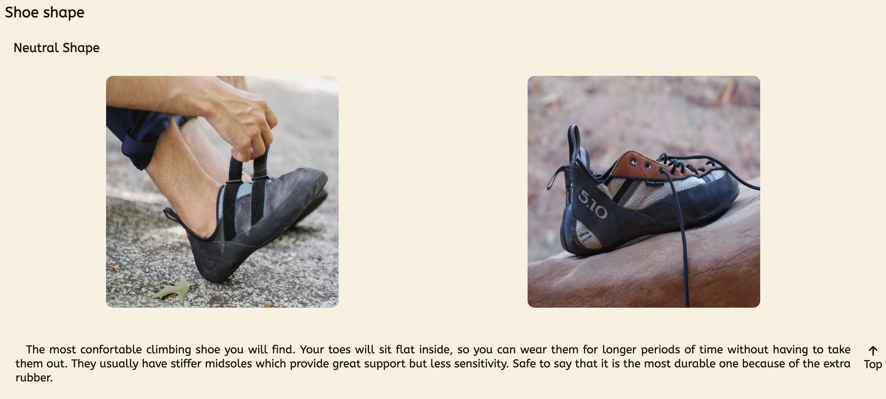

<h1>Climbing Rox</h1>

The Climbing Rox is a webpge for climbers of any level to ready more about the sport, help with equipment they will buy and/or routes they are going to visit.
Access the webpage <a href="https://mariaciceri.github.io/first_project/" target="_blank">here</a>.

<h2>User Story</h2>
<h3>First Timers</h3>
<ul>
    <li>When visiting the page for the first time, the user can ready about the authors in <em>Home</em>.</li>
    <li>The user can easily access the content of the page and navigate through the different sections.</li>
</ul>

<h3>Returning and Frequent Visitors</h3>
<ul>
    <li>The user can easily send a question to the authors and contact them.</li>
    <li>The user can check if there are any new articles.</li>
</ul>

<h2>Features</h2>

<h3>Navigation Bar</h3>
<ul>
    <li>Positioned at the top of the page, below the cover image.</li>
    <li>Contains the following links on the center-right:</li>
        <ul>
            <li>Home/Advice;</li>
            <li>Get Help;</li>
            <li>Follow Us;</li>
        </ul>
    <li> Animated hover effect.</li>
    <li>Call to action:</li>
        <ul>
            <li><em>Get Help</em> will open a popup window to contact the authors with a question.</li>
            <li><em>Follow Us</em> will scroll down to the footer where the user will find icons to click and be redirect to social midia pages. These pages will open in another tab.</li>
        </ul>
    <li>Back to the top button is always visible on the right side of both pages.</li>
</ul>

<h3>Get Help Popup Window</h3>
<ul>
    <li>Get Help navigation tag is clicked, the content that was hidden shows up, as a popup window, darkening the whole page behind.</li>
    <li>The user has to provide full name, email and fill up the text area to be able to submit the form.</li>
    <li>A feedback message then is triggered, letting the user know that the message was received.</li>
    <li>A closing buttom is placing in the top-right corner of both popups.</li>
</ul>

<h3>Hero Section for Home and Advice pages.</h3>
<ul>
    <li>Hero section have a cover background image, a headline, a subtitle and a navbar.</li>
</ul>

<h3>Footer for Home and Advice pages</h3>
<ul>
    <li>The footer contains links to social media pages that will open in a new tab</li>
</ul>

<h2>Home Page</h2>
<ul>
    <li>Introduction of the sport (climbing) and about the authors.</li>
    <li>Brief explanation of the purpose of the webpage.</li>
    <li>The page is responsive: if screen size bigger than mobile screens, About Us text comes next to the picture.</li>
</ul>

<h2>Advice Section</h2>
<h3>Introduction</h3>
<ul>
    <li>A more detailed explanation of the webpage purpose</li>
</ul>

<h3>How to choose climbing shoes article</h3>
<ul>
    <li>Text explaining the purpose of the following content</li>
    <li>Direct links to parts of the content and to navbar to the Get Help form</li>
    <li>The informational text is separated in three sub-categories and a conclusion</li>
    <li>The page is responsive:</li>
    <ul>
        <li>Tablet size: in shoe shape section, the text is next to the example image;</li>
        <li>Desktop/laptop size: in shoe shape section, an extra example picture is available and the content is below the images</li>
    </ul>
</ul>

<h2>Technologies Used</h2>
<ul>
    <li><a href="https://developer.mozilla.org/en-US/docs/Web/HTML" target="_blank">HTML</a> is the foundation of the pages;</li>
    <li><a href="https://developer.mozilla.org/en-US/docs/Web/CSS" target="_blank">CSS</a> adds the style and layout of the pages;</li>
    <li><a href="https://developer.mozilla.org/en-US/docs/Learn/CSS/CSS_layout/Flexbox" target="_blank">CSS Flexbox</a> adds responsiveness to the elements on the page;</li>
    <li><a href="https://gitpod.io/" target="_blank">Gitpod</a> with VScode desktop extension is the IDE for the project;</li>
    <li><a href="https://git-scm.com/" target="_blank">Git</a> main tool to version control the webpage;</li>
    <li><a href="https://github.com/" target="_blank">Github</a> is where the page is hosted.</li>
</ul>

# first_project
HTML/CSS static webpage. First project for Code Institute.

sites that I used for help: <https://dev.to/pachicodes/creating-a-css-modal-window-pop-up-step-by-step-1f59>

<https://www.beyondthesketch.com/developer/css-only-modals/>
