# Climbing Rox

The Climbing Rox is a webpge for climbers of any level to ready more about the sport, help with equipment they will buy and/or routes they are going to visit. 
Access the webpage [here](https://mariaciceri.github.io/first_project/).

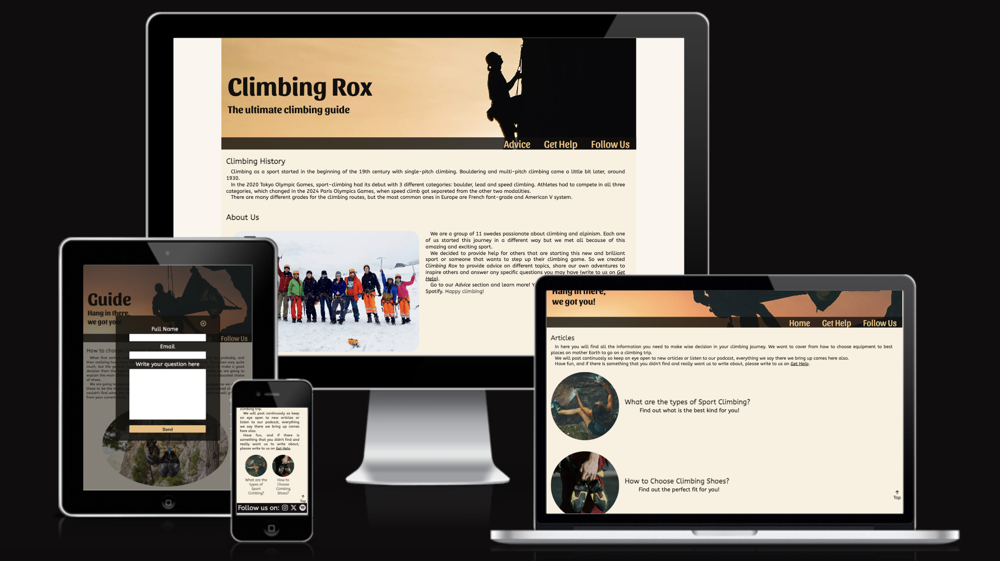

## User Story
### First Timers

+ When visiting the page for the first time, the user can read about the authors in _Home_;
+ The user can easily access the content of the page and navigate through the different sections; 
+ The user can find easily the section containing the articles and choose the one they are interested in;
+ The user can subscribe and follow the authors to be up-to-date with new content being released.

### Returning and Frequent Visitors

+ The user can easily send a question to the authors and contact them; 
+ The user can check if there are any new articles; 

## Features

### Navigation Bar

+ Positioned at the top of the page, below the cover image.
+ Contains the following links on the center-right:
    * Home/Advice; 
    * Get Help; 
    * Follow Us; 
    
+ Animated hover effect. 
+ Call to action:
    * _Get Help_ will open a popup window to contact the authors with a question. 
    * _Follow Us_ will scroll down to the footer where the user will find icons to click and be redirect to social midia pages. These pages will open in another tab. 

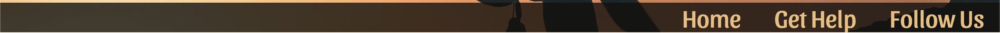
    
+ Back to the top button is always visible on the right side of both pages. 

### Get Help Popup Window

+ When _Get Help_ navigation tag is clicked, the content that was hidden shows up, as a popup window, darkening the whole page behind.
+ The user has to provide full name, email and fill up the text area to be able to submit the form.
+ A feedback message then is triggered, letting the user know that the message was received.
+ A closing buttom is placed in the top-right corner of both popups.

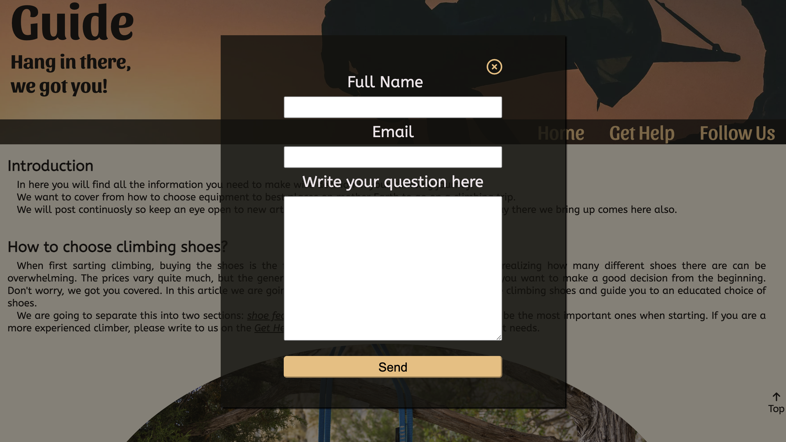
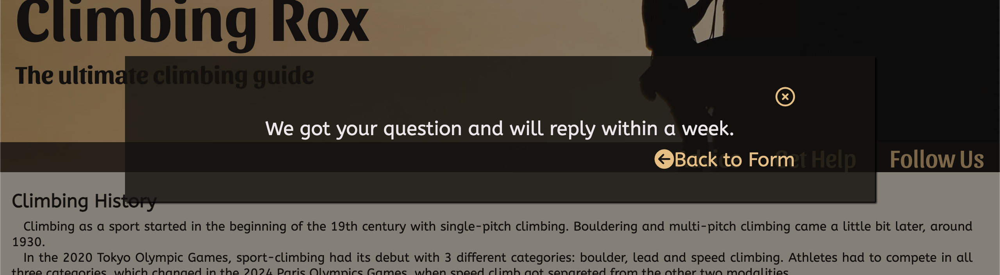

### Hero Section.

+ Hero sections have a cover background image, a headline, a subtitle and a navbar.

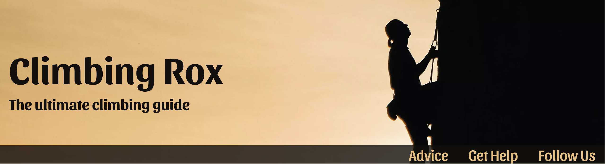
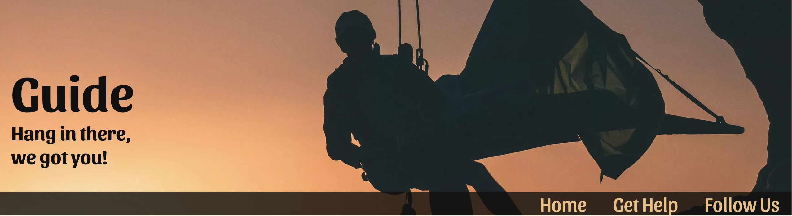

### Footer for Home and Advice pages

+ The footer contains links to social media pages that will open in a new tab.

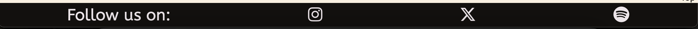

## Home Page

+ Introduction of the sport (climbing) and the authors.
+ Brief explanation of the purpose of the webpage.
+ The page is responsive: if screen size is bigger than mobile screens, About Us text comes next to the picture.

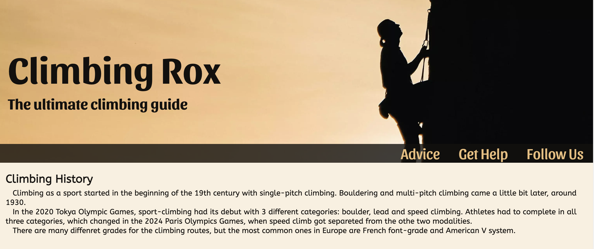
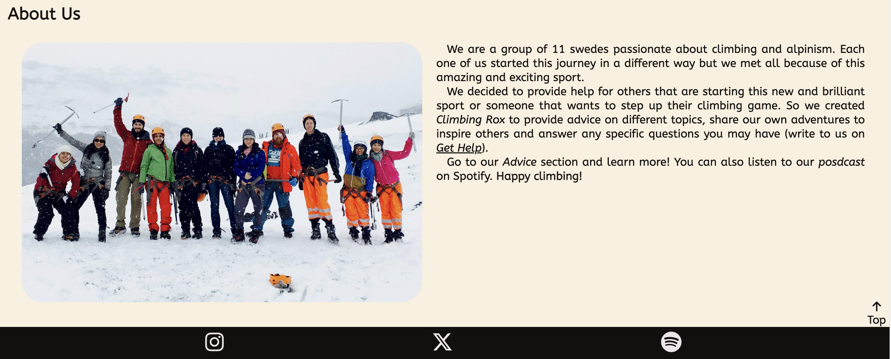

## Advice Section
### Introduction

+ A more detailed explanation of the webpage purpose;
+ Articles available to read are displayed with an image and a title. In larger screens, there is a subtitle and even a hover effect for desktops and laptops.

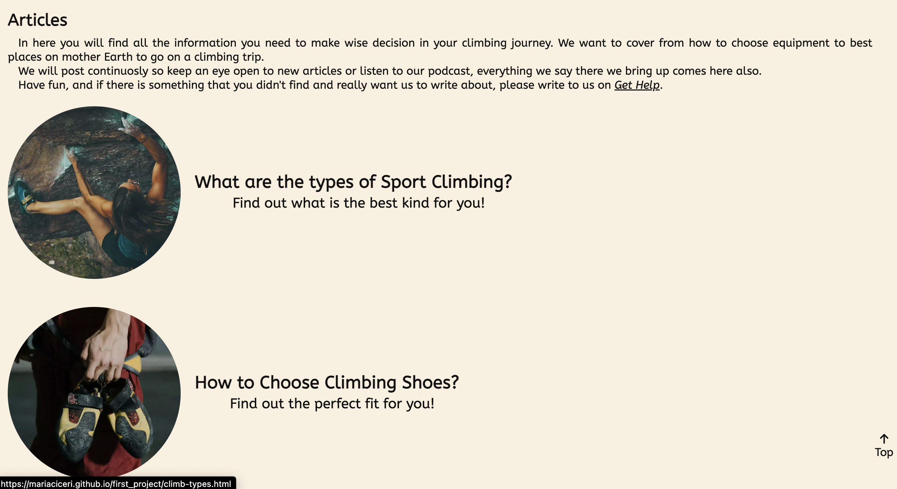

## What are the types of Sport Climbing article

+ The article has the same hero section as the advice and other article.
+ Introduction of the content of this article;
+ Direct link to parts of the content;
+ The informational text is separated in three sub-categories and a conclusion;
+ The page is responsive. To see and read more, refer to [TESTING.md](TESTING.md)

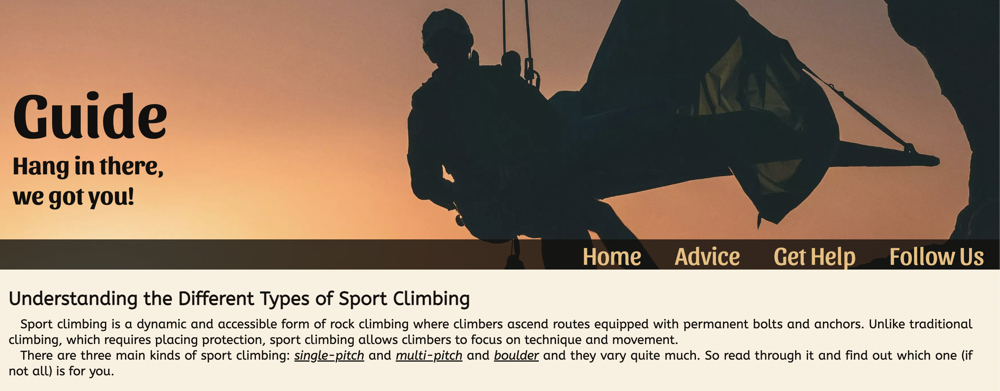

## How to choose climbing shoes article article

+ The article has the same hero section as the advice and other article.
+ Text explaining the purpose of the following content.
+ Direct links to parts of the content and to navbar.
+ The informational text is separated in three sub-categories and a conclusion.
+ The page is responsive. To see and read more, refer to [TESTING.md](TESTING.md)
    
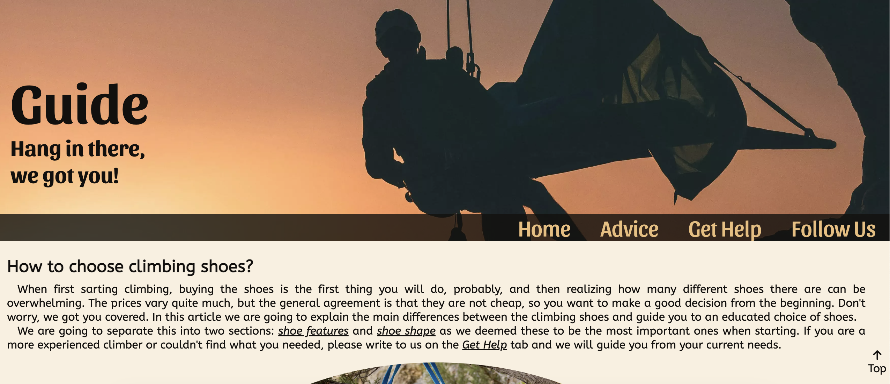

### Features left to implement

+ Make the popup window open everytime _Get Help_ is mentioned so the user don't need to go up to the navbar.
+ When the user can see the whole page and click on follow us, the footer blinks or gives a feedback showing that the links are there.

## Technologies Used

+ [HTML](https://developer.mozilla.org/en-US/docs/Web/HTML) is the foundation of the pages;
+ [CSS](https://developer.mozilla.org/en-US/docs/Web/CSS) adds the style and layout of the pages;
+ [CSS Flexbox](https://developer.mozilla.org/en-US/docs/Learn/CSS/CSS_layout/Flexbox) adds responsiveness to the elements on the pages;
+ [Gitpod](https://gitpod.io/) with [VScode](https://code.visualstudio.com/) desktop extension is the IDE for the project;
+ [Git](https://git-scm.com/) is the main tool to version control the webpage;
+ [Github](https://github.com/) is where the pages are hosted.
+ [Font Awesome](https://fontawesome.com/) is used for icon throughout the whole project.

## Deployment

+ The page was deployed at early stages to GitHub pages. The steps to deploy are as follows:
    * In the GitHub [repository](https://github.com/mariaciceri/first_project), navigate to the Settings tab;
    * On the right-hand side in the menu, click on pages;
    * In Source check if "deploy from branch" is selected, then below it, in Branch, select "main" and save it;
    * To access it for the first time, go back to Code in the main navbar and on the left-hand side scroll down to deployments, click there and open the page;

## Credits

### Content

+ First boilerplate code was taken from [Love Running](https://github.com/mariaciceri/love-running-practice) project of Code Institute;
+ Popup window inspiration and code was taken from [Dev](https://dev.to/pachicodes/creating-a-css-modal-window-pop-up-step-by-step-1f59) and [Beyond the Sketch](https://www.beyondthesketch.com/developer/css-only-modals/);
+ The text and advice section were inspired by [Rei coop](https://www.rei.com/learn/expert-advice/rock-shoes.html?srsltid=AfmBOorRz0dMXRcebMmKl2vc8nr7PmiiQbzrWg8WhAQbV86vnILnHNRb);
+ Footer icons were taken from [Font Awesome](https://fontawesome.com/).

### Media

+ Images were taken from [Unsplash](https://unsplash.com/), [Pexels](https://unsplash.com/) and free trial of [Adobe Stock](https://stock.adobe.com/se/search?k=%22climbing+shoes%22&search_type=recentsearch).

