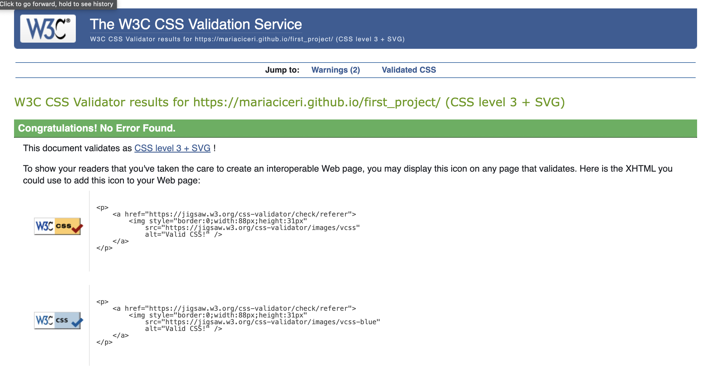

# TESTING

To ensure that the webpage works in all platforms and is responsive in different divices, a series of tests were run:

## Compatibility

* The page was tested on Chrome and Safari and it showed the same results. For content disposition and responsive aspects.
* The page was also opened and all buttons were clicked in a real tablet, a phone and two different computers with different operational systems. The form was submitted in all these devices also.

## Responsiveness

The pages are responsive to fit better different screen sizes: pictures are rearranged to have a better layout.

* Tablet size: in shoe shape section, the text is next to the example image;
* Desktop/laptop size: in shoe shape section, an extra example picture is available and the content is below the images;
* In about us, the text collapses to the side of the picture in larger screens (tablet and laptop).

## Validation

* HTML
    - No errors or warnings were found when running the code on the official W3C validator.

* CSS
    - One warning was found in the CSS style sheet when running on the official W3C validator:
        + the background color for the button is the same as the border color. This is intentional and it is working as intended. 

## Lighthouse

* Using lighthouse in devtools it is confirmed that the overall perfomance is efficiently, accessible and colors and fonts chosen are readable.

    - Home page

    

    - Advice page

    

## Bugs

There weren't many bugs along the way for mobile and tablet screen sizes. For desktop the following bug was spotted and fixed:

* Bug: When the two images were seen in larger screens than 13", they were not centralized. 
    - Fix: set the imagine class to inline block and the div class to align the text centered. Realign the text and title to the left.

* Bug: In advice section, in the anchor element, the text was collapsing on top of each other while the picture was not.
    - Fix: Remove position: relative in parent element and position: absolute in the text class.

* Bug: Style not applying on my h3 with id=single-pitch because of wrong syntax;
    - Fix: Use proper syntax.

