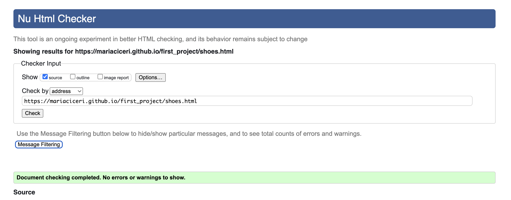

# TESTING

To ensure that the webpage works on all platforms and is responsive on different devices, a series of tests were run:

## Compatibility

* The page was tested on Chrome, Firefox and Safari and it showed the same results. For content disposition and responsive aspects.
* The page was also opened and all buttons were clicked on a real tablet, a phone and two different computers with different operational systems. The form was submitted on all these devices also.

## Manual Testing

+ The following tests were conducted and passed:

    * Navbar:
        - Click on the home button: redirects to home page;
        - Click on advice button: redirects to advice page;
        - Click on get help: popup window appears;
        - Click on follow us: page goes down to the footer;

    * Get help popup:
        - Click on the closing icon: closes the popup and is back where you were;
        - After filling out the form, click on send: reveals a feedback popup message;

    * Feedback popup message:
        - Click on back to the form button: goes back to the form;
        - Click on the closing icon: closes the popup and is back where you were;

    * Footer:
        - Click Instagram icon: opens the instagram page on a new tab;
        - Click X icon: opens the X page on a new tab;
        - Click Spotify icon: opens the Spotify page on a new tab;

    * Home page: 
        - All navbar links work as previously described;
        - Click on get help anchor in the text: page goes up to show navbar;

    * Advice page:
        - All navbar links work as previously described;
        - Click on article "What are the types of sport climbing?": redirects to the article;
        - Click on article "How to choose climbing shoes": redirects to the article;

    * "What are the types of sport climbing?" article page:
        - Click on single-pitch link in the text: jumps to this section of the text;
        - Click on multi-pitch link in the text: jumps to this section of the text;
        - Click on boulder link in the text: jumps to this section of the text;

     * "How to choose climbing shoes?" article page:
        - Click on shoe features link in the text: jumps to this section of the text;
        - Click on shoe shape link in the text: jumps to this section of the text;
        - Click on get help link in the text: page goes up to show navbar;

## User Testing

* A friend tested on her mobile and could not understand the follow-up button.
    - To remedy that, was added a sentence to the footer to indicate to the user that the links are there.

## Responsiveness

The pages are responsive to fit different screen sizes: pictures are rearranged to have a better layout.

* Tablet size: in the shoe shape section, the text is next to the example image;
* Desktop/laptop size: in shoe shape section, an extra example picture is available and the content is below the images;
* In About Us, the text collapses to the side of the picture On larger screens (tablet and laptop);
* Refer to [RESPONSIVE-GIFS.md](RESPONSIVE-GIFS.md) for screen shots of the whole pages in different screen sizes.

## Validation

* HTML
    - No errors or warnings were found when running the code on the official W3C validator.

    - Home
    

    - Advice
    
    
    - Sport Climbing Styles article
    
    
    - Choosing Shoes article
    

* CSS
    - Two warnings were found in the CSS style sheets when running on the official W3C validator:
        + The background color for the button is the same as the border color. This is intentional and it is working as intended. 

## Lighthouse

* Using lighthouse in dev tools it is confirmed that the overall performance is efficient and accessible and colors and fonts chosen are readable.

    - Home page

    

    - Advice page

    

    - Sport Climbing Styles article

    

    - Choosing Shoes article

    

## Bugs

The majority of bugs were found for larger screens, but even for tablet size, there were a couple.

* Bug: When the two images were shown on desktop screen sizes, they were not centralized. 
    - Fix: set the image class to inline-block and the div class to align the text centered. Realign the text and title to the left.

* Bug: In the advice section, in the anchor element, the text was collapsing on top of each other while the picture was not.
    - Fix: Remove position: relative in parent element and position: absolute in the text class.

* Bug: Style not applying on the h3 with id=single-pitch because of wrong syntax;
    - Fix: Use proper syntax.

* Bug: Back-to-top button was out of the content area for larger screens;
    - Fix: using the function calc in CSS to position it to the right on any screen larger than 1200px.

* Bug: Using the function calc made the back-to-top button disappear in screens between 992px and 1200px;
    - Fix: Create a new media query to apply this change only when the screens are larger than 100px.

